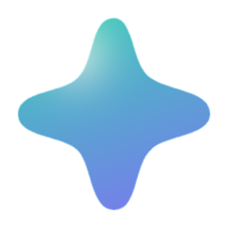

<div align="center">



# StarGlass

Windows 桌面上的 GitHub 监控面板，用液态玻璃显示项目的 Stars 与下载量。

[下载](https://github.com/LoMoCatAp/StarGlass/releases) · [反馈](https://github.com/LoMoCatAp/StarGlass/issues) · [作者 LomoCat](https://github.com/LoMoCatAp)

</div>

## 简介

StarGlass 是一个可自行配置的 Windows 桌面工具。双击打开玻璃面板，通过面板右键或系统托盘进入设置，添加仓库、调整材质和外观。

玻璃背景来自实时桌面，使用 Windows Graphics Capture 获取后方窗口的 GPU 图像，再通过 Direct3D 11 和 HLSL 完成背景合成、折射、色散和磨砂。Electron 与 React 负责设置界面、托盘和 GitHub 数据。

当前为 **0.10.1-dev 预览版**，提供 Windows x64 便携程序。

## 当前功能

- **仓库监控**：Stars、Release 附件累计下载、Fork、版本及本地趋势，最多添加 12 个仓库。
- **多面板**：最多同时显示 12 个项目，共享 GPU 桌面背景；每个窗口单独保存位置和外观。
- **展示模式**：常规、紧凑、Mini 胶囊，以及只保留材质的纯玻璃模式。
- **独立外观**：每个项目可设置尺寸、圆角、胶囊或直角形状、边缘缩放、字体、描边、图标及名称显隐。
- **玻璃调节**：不透明度、磨砂、折射、色散、光泽、色调及 15–360 FPS 上限，默认跟随显示器刷新率。
- **自动字色**：根据文字区域的玻璃背景选择深色或浅色，带防抖和约 250 ms 平滑过渡。
- **桌面行为**：拖动、置顶、鼠标穿透、显示与隐藏、开机启动。
- **设置主题**：深色、浅色、跟随系统；保存后实时应用。
- **同步**：可配置间隔、手动刷新、ETag 缓存和限流退避；可选 GitHub Token。

## 使用

1. 前往 [Releases](https://github.com/LoMoCatAp/StarGlass/releases)，下载 `StarGlass-0.10.1-dev-Windows.exe`。
2. 放在固定位置后双击运行，无需安装。更新时先从托盘退出旧版本，再运行新版。
3. 右键面板或托盘图标打开设置，在「监控项目」添加 `owner/repo` 或 GitHub 仓库链接。
4. 在「玻璃外观 → 配置哪个面板」选择默认外观或某个项目，调整后点击「应用设置」。
5. 需要多开时启用「多面板（最多 12 个）」。Mini 可同时启用「仅显示玻璃」。

默认监控项目为 [`LoMoCatAp/Bika-HarmonyOS`](https://github.com/LoMoCatAp/Bika-HarmonyOS)。鼠标穿透启用后，可从托盘关闭；彻底退出应用使用托盘的「退出 StarGlass」。

### 数据说明

- Stars 来自 GitHub 当前的 `stargazers_count`。
- 下载量是所有已发布 Release 附件的累计下载次数，包含预发布、排除草稿，Release 与附件均完整分页；不包含自动生成的源码 ZIP/TAR、仓库 Clone 或其他平台下载。
- 删除 Release 或附件可能使累计下载量下降。历史从首次成功监控开始积累，保留最近 90 天，不补造过去数据。
- 默认每 30 分钟同步，手动刷新最短间隔 1 分钟。玻璃帧率和 GitHub 数据同步频率是两个独立设置。
- 公开仓库无需 Token。访问私有仓库或提高请求额度时，可在「数据与同步」配置有对应仓库读取权限的 Token。

### 截图与录屏

面板默认可被系统截图和录屏捕捉，无需开启开关，背景保持实时更新。应用分别采集后方窗口的 GPU 图像并排除自身作为背景来源，避免递归反馈；旧版截图开关会自动迁移，不再使用固定快照。合成时保留窗口整体透明度与色键，透明覆盖窗口不再把动态壁纸盖成黑色。已在 Wallpaper Engine 2.8.42 的场景壁纸上验证，其他壁纸类型尚未全面验证。

## 当前限制

- 支持 Windows x64，建议 Windows 11；实时背景路径需要 Windows 10 2004 或更新版本；Windows 10 的系统采集边框行为尚未全面验证。
- 多面板目前共享主面板所在显示器的背景。跨显示器、不同 DPI、多 GPU 以及锁屏恢复尚未全面验证。
- 实际帧率受显示器、GPU、面板数量和尺寸影响。受保护内容或特定显示会话可能无法采集。
- 面板是独立悬浮窗口，尚未嵌入 Explorer 桌面。当前程序未进行商业代码签名。

## 源码运行

准备 Node.js 22.12+、CMake 3.20+、Visual Studio 2022 的「使用 C++ 的桌面开发」工作负载与 Windows SDK。

```powershell
git clone https://github.com/LoMoCatAp/StarGlass.git
cd StarGlass
npm ci
npm start
```

原生依赖已包含在 `native/vendor/`，构建不依赖本机参考项目目录。`npm start` 会构建兼容采样器、原生 GPU 面板和设置界面，再启动应用。

仅预览设置页面：

```powershell
npm run dev
```

浏览器预览不连接真实仓库数据；预览图中的材质和数字用于布局示意。

## 构建与验证

```powershell
npm test
npm run dist       # Windows x64 便携 EXE
npm run pack       # Windows 目录版
node scripts/package-smoke.cjs
node scripts/direct-capture-smoke.cjs
node scripts/rounded-outline-smoke.cjs
node scripts/twelve-panels-smoke.cjs
```

生成文件位于 `release/`。GUI 验证使用独立配置，输出保存在 `test-results/`；不会修改日常使用的数据。自动验收主要针对开发程序和打包目录版，便携 EXE 的自解压流程尚未单独自动驱动。

透明覆盖窗口的回归测试另需构建专用夹具；该窗口仅在测试期间运行，不参与应用打包：

```powershell
cmake -S tests/native -B .test-data/native-fixtures -G "Visual Studio 17 2022" -A x64
cmake --build .test-data/native-fixtures --config Release
node scripts/layered-capture-smoke.cjs
```

## 隐私与本地数据

- 设置和历史默认位于 `%APPDATA%/starglass/state.json`。
- Token 使用 Windows 用户级系统加密存储，不会传递回设置界面。
- 网络请求用于访问 GitHub API，不接入第三方统计或开发者服务器。
- 桌面图像在本机处理，正常运行不保存或上传桌面帧；开发者显式启用帧导出时除外。

## 项目结构

```text
src/                    React 设置页面与布局预览
electron/               主进程、GitHub 同步、托盘与原生面板通信
native/glass-panel/     StarGlass 原生窗口、内容与自动字色
native/vendor/          glass、Dear ImGui 与 FreeType 构建依赖
assets/                 应用和托盘图标
licenses/               随程序分发的第三方许可全文
scripts/                构建与桌面验证
tests/                  数据、设置和通信协议测试
```

## 致谢

感谢以下开源项目及其作者：

- [poncippg-spec/liquidDX11](https://github.com/poncippg-spec/liquidDX11)：原生 DXGI / D3D11 液态玻璃基础；StarGlass 在此基础上接入监控内容、独立面板设置与共享 GPU 背景。
- [ocornut/imgui](https://github.com/ocornut/imgui)：原生面板的布局与绘制。
- [FreeType](https://freetype.org)：字体光栅化。Portions of this software are copyright © 1996–2024 The FreeType Project. All rights reserved.
- [iyinchao/liquid-glass-studio](https://github.com/iyinchao/liquid-glass-studio)：早期 WebGL 玻璃路径的折射和色散公式参考。
- [molian313/dynamic-island](https://github.com/molian313/dynamic-island)：桌面采样与捕捉排除的架构参考。
- [Electron](https://github.com/electron/electron)、[React](https://github.com/facebook/react)、[Vite](https://github.com/vitejs/vite)、[Lucide](https://github.com/lucide-icons/lucide)：桌面外壳、设置界面、构建与图标。

完整授权说明见 [THIRD_PARTY_NOTICES.md](THIRD_PARTY_NOTICES.md)。

## 作者与反馈

- 作者：[LomoCat](https://github.com/LoMoCatAp)
- 项目：[LoMoCatAp/StarGlass](https://github.com/LoMoCatAp/StarGlass)
- Bug 与功能建议：[GitHub Issues](https://github.com/LoMoCatAp/StarGlass/issues)

## License

StarGlass 以 [MIT License](LICENSE) 开源。第三方组件保留各自许可证，详见 [第三方说明](THIRD_PARTY_NOTICES.md) 与 `licenses/`。
